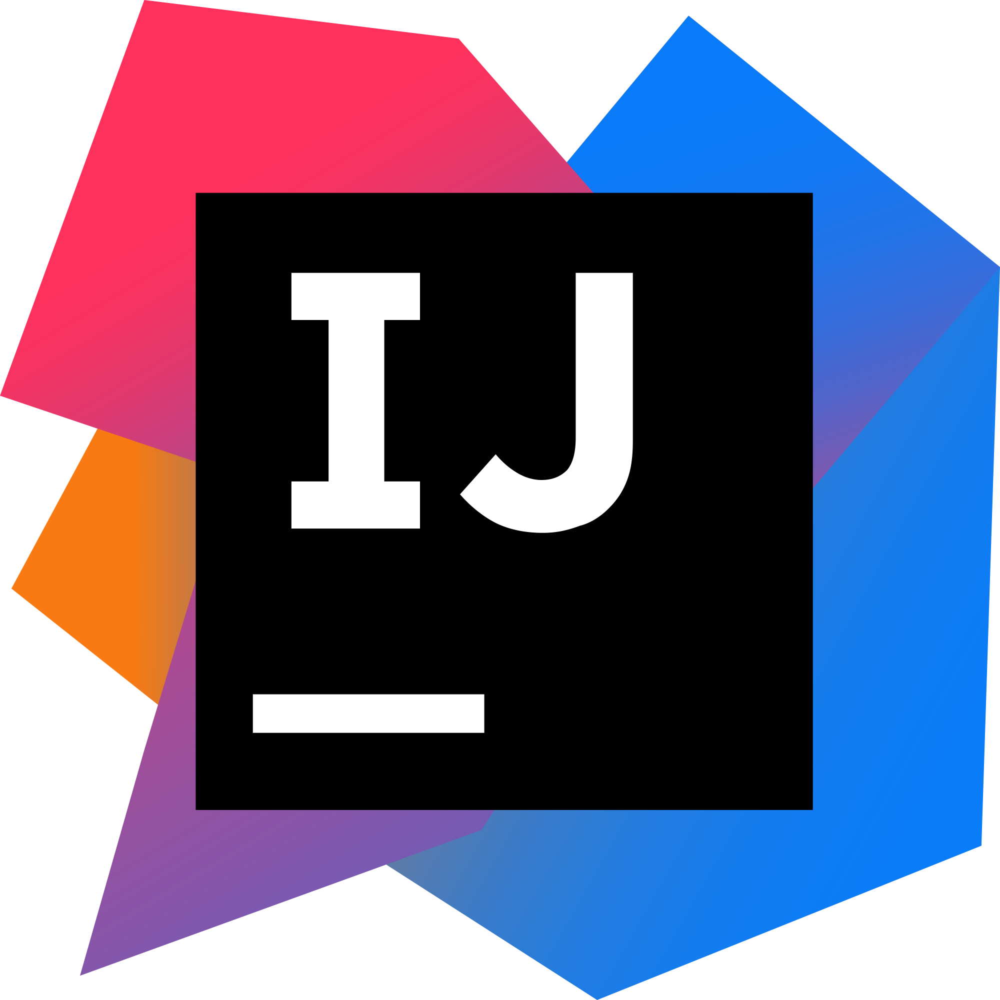

## Hi there 👋 My name is Michał

### **🎓 I am a Computer Science Student passionate about programming!** 

- 🔭 I’m currently working on my REST API developed in Springboot.
- 🌱 I’m currently learning as much as I can!
- 📫 How to reach me? Let's try [LinkedIn](https://www.linkedin.com/in/michał-misiak/)
- ⚡ Take a peek on my last project! [AutoExpense](https://github.com/HiImMishu/AutoExpenseAndroid)

---

### 🛠️ Languages and Tools I use:

---

### 🔎 Take a look at:

<!--  -->